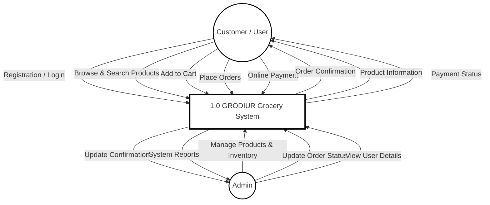
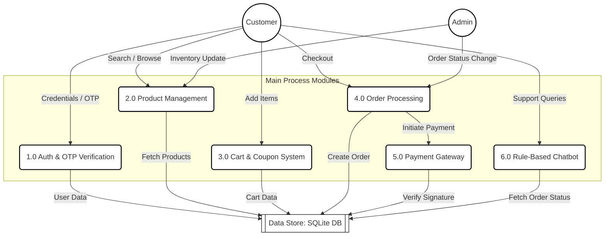
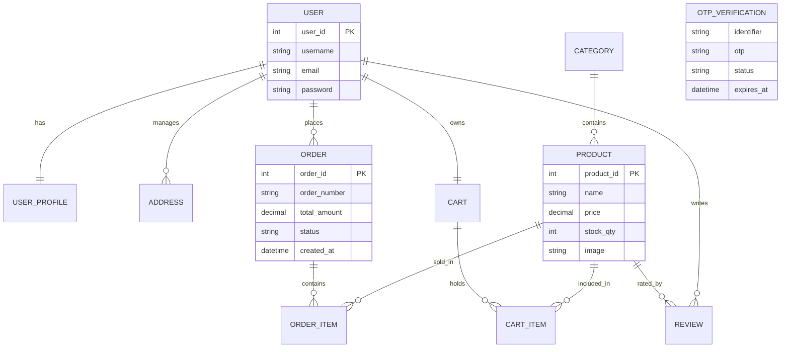
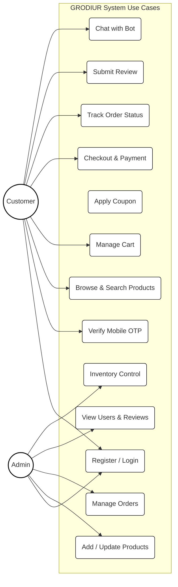
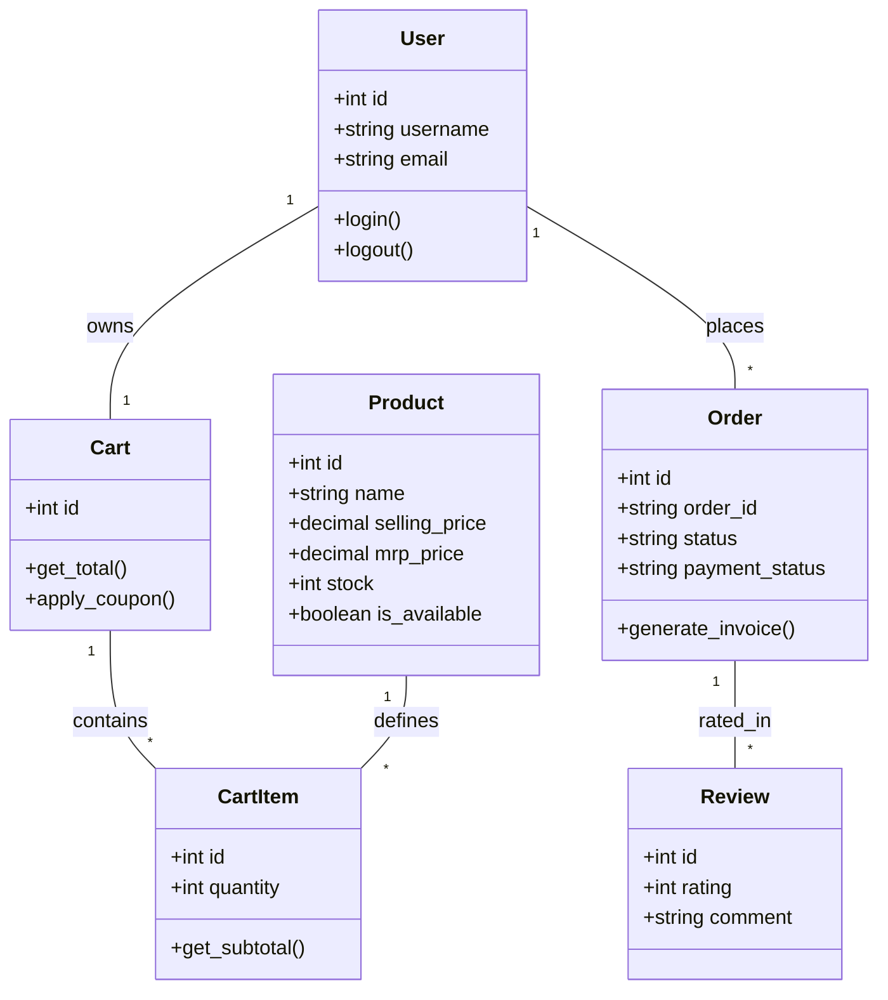
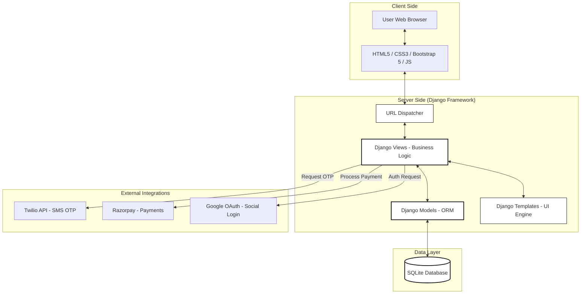

# GRODIUR - Project Diagrams (BCA Final Year)

This document contains professional, academic-style diagrams generated for the **GRODIUR – Online Grocery Shopping System** project. 

---

## 1. DFD Level 0 (Context Diagram)

---

## 2. DFD Level 1 (Functional Decomposition)

---

## 3. Entity Relationship (ER) Diagram

---

## 4. UML Use Case Diagram

---

## 5. UML Class Diagram

---

## 6. System Architecture Diagram

