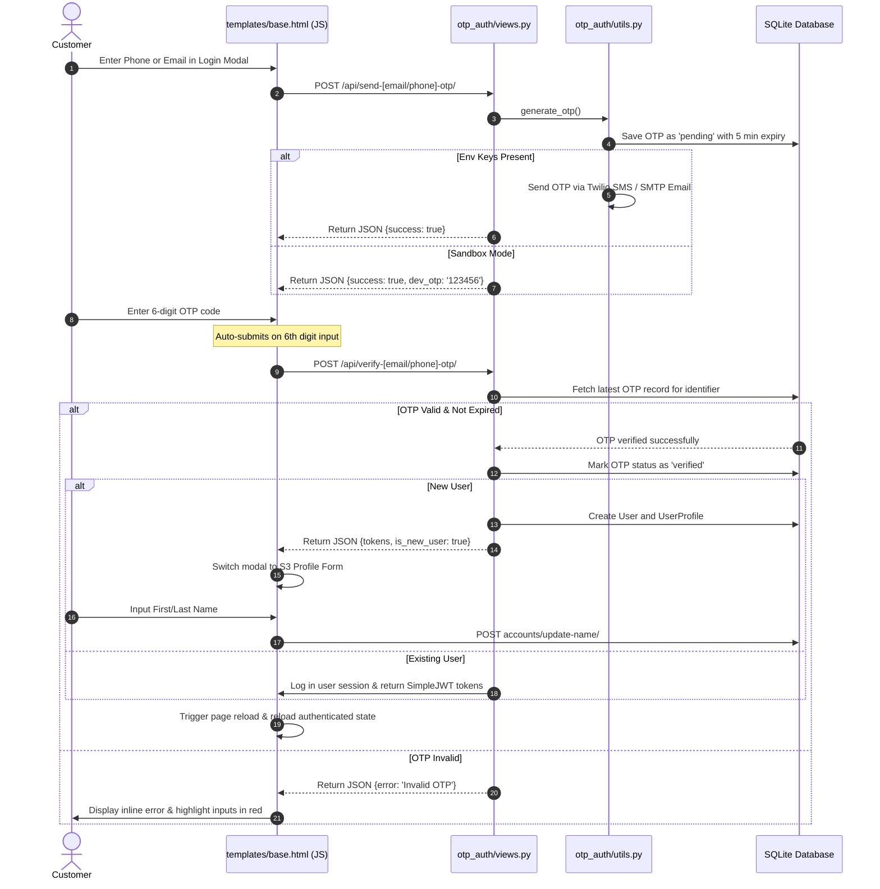
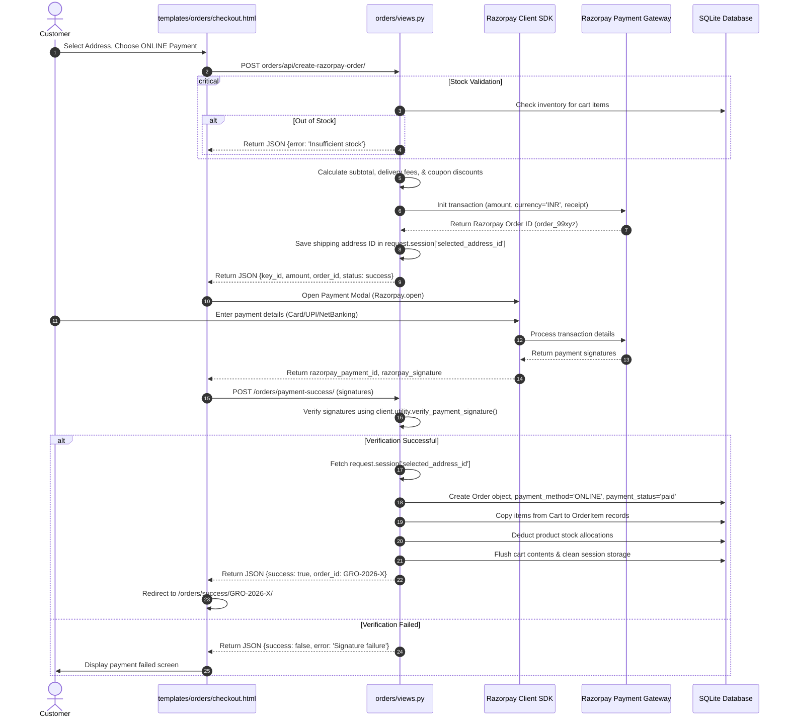
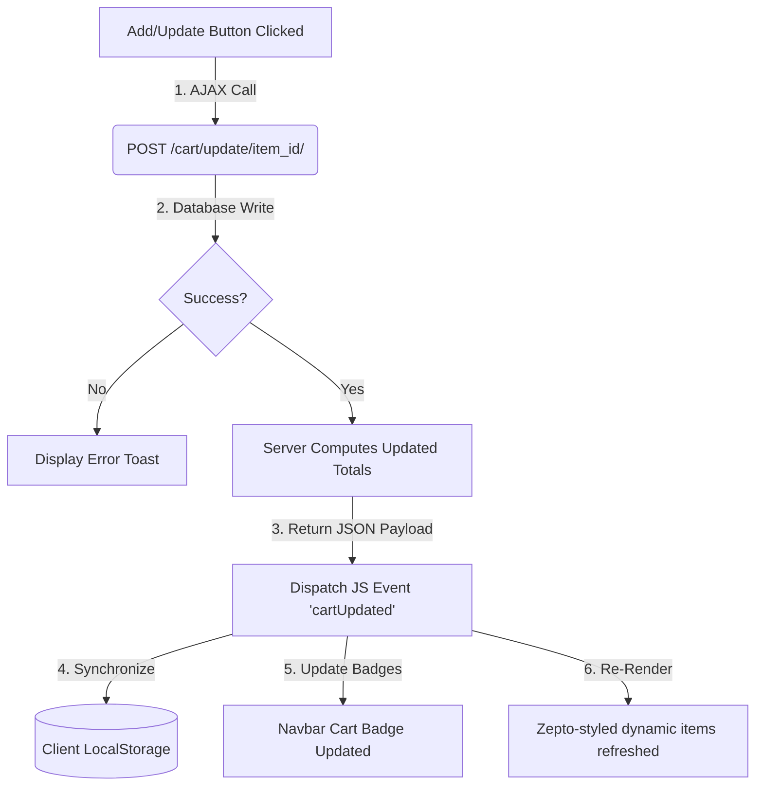
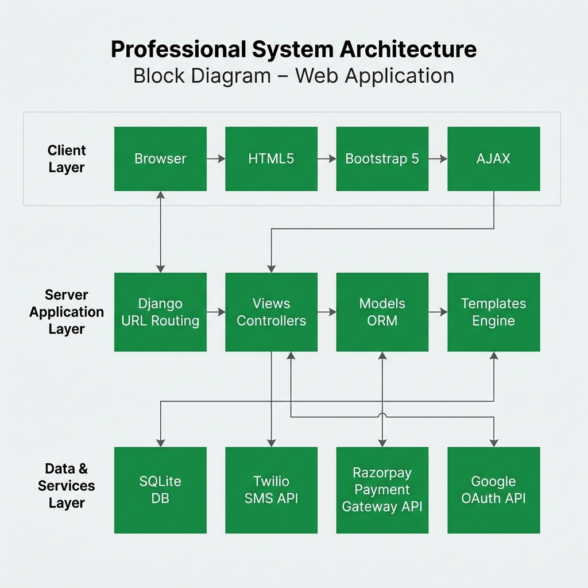

# Grodiur: Full-Stack Grocery Delivery Platform
## Technical Architecture & Codebase Documentation
> [!NOTE]
> This document provides a highly detailed, professional, and recursively mapped architectural blueprint of the **Grodiur** platform. It covers everything from global configuration down to app-level schema definitions, core database models, routing tables, API controllers, and key transactional workflows.

---

## 1. Complete Project Directory Tree

Below is the complete project directory tree of the **Grodiur** system. It encompasses every Django app, main configurations, template layers, custom testing files, and dev environment assets.

```text
tvk/ (Project Workspace Root)
│
├── .venv/                      # Python virtual environment
├── .sixth/                     # Sixth-level configuration cache
├── .vscode/                    # IDE settings and launch configurations
│
└── grodiur/                    # Primary Grodiur Django project root
    │
    ├── manage.py               # Django project management CLI
    ├── requirements.txt        # Backend dependencies & packages
    ├── db.sqlite3              # Persistent SQLite database (local dev)
    ├── .env                    # Active local environment variables
    ├── .env.example            # Blueprint for required environment setup
    ├── Procfile                # Heroku/Render production execution script
    ├── build.sh                # Production static compression build script
    ├── render.yaml             # Render cloud platform deployment pipeline
    ├── seed_db.py              # Automatic database seeding script for catalogs
    │
    ├── test_full.py            # Comprehensive 15-section functionality test suite
    ├── test_workflow.py        # Core transactional pipeline verification test
    │
    ├── grodiur/                # Core Settings & Global URL Configuration
    │   ├── __init__.py
    │   ├── asgi.py             # Asynchronous gateway interface hook
    │   ├── wsgi.py             # Web server gateway interface hook
    │   ├── settings.py         # Global Django settings, middlewares, apps, & keys
    │   └── urls.py             # Global URL mapping & route routing tables
    │
    ├── accounts/               # User Profiles, Addresses, and Preferences
    │   ├── __init__.py
    │   ├── admin.py            # Admin Panel registrations for user meta tables
    │   ├── apps.py             # Accounts app configuration parameters
    │   ├── adapters.py         # Social login adapter hooks (e.g. Google auth)
    │   ├── forms.py            # Secure registration & login Django forms
    │   ├── models.py           # UserProfile, Address, & UserPreference schemas
    │   ├── urls.py             # Profile, Address, & Wishlist views routing
    │   └── views.py            # AJAX Address CRUD, identity & settings handlers
    │
    ├── products/               # Grocery Catalog & Fuzzy Product Search
    │   ├── __init__.py
    │   ├── admin.py            # Category, Product, & Wishlist admin configurations
    │   ├── apps.py
    │   ├── models.py           # Category & Product models with calculated averages
    │   ├── urls.py             # Catalog list, details, and search routes
    │   └── views.py            # Q-filter combined fuzzy search & category lists
    │
    ├── cart/                   # Database-Backed AJAX Shopping Carts
    │   ├── __init__.py
    │   ├── admin.py            # Cart, CartItem, & Coupon registrations
    │   ├── apps.py
    │   ├── models.py           # Dynamic subtotal, free delivery & discount calculations
    │   ├── templatetags/       # Custom filter tags for templates
    │   ├── urls.py             # AJAX quantity adjustment and coupon paths
    │   └── views.py            # Database synchronization controllers
    │
    ├── orders/                 # Order Life-Cycle, Razorpay Engine, and Support
    │   ├── __init__.py
    │   ├── admin.py            # Order, OrderItem, & SupportTicket admin panel
    │   ├── apps.py
    │   ├── models.py           # GRO-YYYY-XXXX order & TICK-YYYY-XXXX ticket schemas
    │   ├── urls.py             # Checkout, Razorpay callback, invoices, & history paths
    │   └── views.py            # COD checkout and online signature verification view
    │
    ├── otp_auth/               # Secure Passwordless Registration & Session Login
    │   ├── __init__.py
    │   ├── admin.py            # OTPVerification admin panel
    │   ├── apps.py
    │   ├── models.py           # Verification attempts & dynamic expiry timestamps
    │   ├── serializers.py      # Serializers for SimpleJWT REST framework views
    │   ├── utils.py            # SMS/Email OTP generators & Twilio fallbacks
    │   ├── urls.py             # REST token refresh & send/verify OTP routes
    │   └── views.py            # User registration & active session decorators
    │
    ├── chatbot/                # Intelligent Rule-Based Contextual Chat Assistant
    │   ├── __init__.py
    │   ├── admin.py
    │   ├── apps.py
    │   ├── models.py
    │   ├── urls.py             # Chatbot endpoint routing
    │   └── views.py            # Intent classification router & recent order lookup
    │
    ├── reviews/                # Customer Ratings & Product Feedback
    │   ├── __init__.py
    │   ├── admin.py            # Reviews registration
    │   ├── apps.py
    │   ├── models.py           # Stars (1-5), comments, and unique-user constraints
    │   ├── urls.py             # Review submission paths
    │   └── views.py            # Reviews view controller
    │
    ├── authentication/         # Legacy Auth boilerplate
    │   ├── __init__.py
    │   ├── admin.py
    │   ├── apps.py
    │   ├── models.py
    │   └── views.py
    │
    ├── staticfiles/            # Compressed & cached production static directories
    │
    ├── media/                  # Dynamic product images & customer upload folder
    │
    └── templates/              # High-Fidelity Front-End Django Templates
        ├── base.html           # Main template containing layout, navbar, & AJAX scripts
        ├── home.html           # Homepage rendering catalog slides & marketing tabs
        │
        ├── accounts/           # User dashboard, Addresses, settings & wishlists
        │   ├── login.html
        │   ├── register.html
        │   ├── profile.html
        │   ├── saved_addresses.html
        │   ├── settings.html
        │   ├── payment_methods.html
        │   └── wishlist.html
        │
        ├── cart/
        │   └── cart_detail.html # Responsive Zepto-styled shopping cart UI
        │
        ├── orders/
        │   ├── checkout.html      # Multi-step checkout form & calculation cards
        │   ├── order_success.html # Order tracking dashboard & timeline components
        │   ├── order_history.html # Historical order timelines & re-order helpers
        │   ├── order_detail.html  # Live order tracking and support ticket modules
        │   └── invoice.html       # Print-formatted clean digital commercial invoices
        │
        ├── products/
        │   ├── product_list.html  # Category sidebar & searchable responsive grid
        │   └── product_detail.html# Image zoom, rating summary & related products
        │
        └── reviews/
            └── add_review.html    # Star rating selectors & reviews submission
```

---

## 2. Django Apps: Detailed Architectural Mappings

The Grodiur system is split into modular apps, each obeying the **Model-View-Template (MVT)** pattern.

### 2.1. Global Configuration app: `grodiur`
- **Purpose**: Acts as the project orchestration engine. Links core middlewares, databases, environment setups, and static/media compilation hooks.
- **Key Modules**:
  - **`settings.py`**:
    - Registers all apps alongside external libraries: `rest_framework`, `rest_framework_simplejwt`, `corsheaders`, `allauth`, and `allauth.socialaccount.providers.google`.
    - Manages SMTP server integrations (`EMAIL_BACKEND`), database mappings (SQLite `db.sqlite3`), and security tokens.
    - Captures payment engine configuration keys (`RAZORPAY_KEY_ID`, `RAZORPAY_KEY_SECRET`) and communications configurations (`TWILIO_ACCOUNT_SID`, `TWILIO_AUTH_TOKEN`, `TWILIO_PHONE_NUMBER`).
  - **`urls.py`**: Orchestrates global routing across app modules. Handles local media delivery fallbacks via `django.views.static.serve` so images load on development systems even when `DEBUG = False`.

---

### 2.2. User Identity Management: `accounts`
- **Purpose**: Governs profile detail edits, physical address records, and wishlist bookmarks.
- **Database Schema & Models**:
  ```mermaid
  erDiagram
      USER ||--|| USERPROFILE : "has 1:1 profile"
      USER ||--o{ ADDRESS : "saves 0..N addresses"
      USER ||--|| USERPREFERENCE : "defines 1:1 preferences"
      
      USERPROFILE {
          string phone "Null/Blank allowed, unique"
          string city "Bangalore by default"
      }
      ADDRESS {
          string full_name "Billed customer"
          string phone "Recipient contact"
          string house_street "Building & Road details"
          string city "City name"
          string pincode "6-digit ZIP"
          boolean is_default "True/False"
      }
      USERPREFERENCE {
          boolean email_notifications "Default True"
          boolean sms_notifications "Default True"
          boolean dark_mode "Default False"
      }
  ```
- **Special DB Behavior**: The `Address` model features a custom overloaded `.save()` method. If a user sets an address as `is_default=True`, the saving thread automatically targets all other addresses owned by that user and updates them to `is_default=False` in a single atomic database operation.
- **Routes & Controllers**:
  - `register_view` & `login_view`: Renders registration and standard logging mechanisms.
  - `saved_addresses` [POST JSON AJAX]: Implements shipping location manipulations. Supports interactive, single-page operations with the following action payloads:
    - `add`: Spreads payload details to create shipping locations.
    - `edit`: Filters location objects and applies modifications.
    - `delete`: Atomically wipes selected address records.
    - `set_default`: Strips defaults and marks the targeted address as primary.

---

### 2.3. Digital Catalog: `products`
- **Purpose**: Manages categories, dynamic catalog displays, and searchable inventories.
- **Database Schema & Models**:
  - `Category`: Represents categories (e.g., vegetables, daily dairy) with slug-based lookups.
  - `Product`: Represents product lines storing:
    - Price points (`price`) and Manufacturer Suggested Retail Prices (`mrp_price`).
    - Measurement labels (`unit`, e.g., "500g", "1L").
    - Real-time stock counts (`stock`).
- **Core View Algorithms**:
  - `product_list`: Filters categories via URL search params, handling search inputs (`?q=`) and category filters (`?category=`).
  - `api_product_search` [Fuzzy Search API]: Handles input from the chatbot with fuzzy matching.
    - Strip common plural suffixes (e.g. converting "tomatoes" to "tomato", "onions" to "onion").
    - Clean command prefixes (e.g. stripping "show ", "find ", "need ", "buy ", "i want ") for direct keyword searches.
    - Uses Django's `Q` objects to perform case-insensitive substrings matches across category names, description fields, and product names:
      ```python
      q_filter |= Q(name__icontains=term) | Q(description__icontains=term) | Q(category__name__icontains=term)
      ```
    - Caps output at the top 8 distinct hits for optimized card sizes in chatbot threads.

---

### 2.4. AJAX Shopping Cart: `cart`
- **Purpose**: Manages persistent cart shopping states stored in the database for logged-in users, synced with templates via REST endpoints.
- **Database Schema & Models**:
  - `Coupon`: Stores validation schedules, minimum spending requirements, flat/percentage discount formulas, and max cap rules.
  - `Cart`: Linked 1:1 with User. Houses helper calculation wrappers that serve as the single source of truth for order checkout pricing:
    - **`get_subtotal()`**: Sums `item.price * item.quantity` for all contained items.
    - **`get_coupon_discount()`**: If a coupon is validated and loaded into the session, calculates either a percentage or flat discount, up to the coupon's maximum cap.
    - **`get_delivery_fee()`**: Free above ₹199; otherwise applies a standard ₹39 delivery charge.
    - **`get_total()`**: Computes final costs: `Subtotal - Discount + Delivery Fee`.
  - `CartItem`: Links a Cart to a Product, tracking individual line quantities.
- **Routes & Controllers**:
  - AJAX updates via `update_cart_ajax` update CartItem counts directly on the database.
  - `apply_coupon` validates dates and spending thresholds before registering coupon codes into the session database.

---

### 2.5. Transactions & Logistics: `orders`
- **Purpose**: Operates the multi-step checkout engine, validates Razorpay payments, maintains the tracking timeline, and captures support requests.
- **Database Schema & Models**:
  - `Order`: Captures structural details at order time:
    - Formats order numbers using the custom sequence: `GRO-YYYY-XXXX`.
    - Captures snapshots of delivery locations, billing names, final pricing rates, and coupon references.
    - Tracks order fulfillment states: `pending`, `confirmed`, `shipped`, `delivered`, or `cancelled`.
  - `OrderItem`: Stores snapshots of purchase prices to preserve historical sales records if a product's base catalog price changes.
  - `SupportTicket`: Formats customer support requests as `TICK-YYYY-XXXX`.
- **Views**:
  - `checkout`: Renders checkout pages. Upon receiving a POST request, validates stock balances and places standard Cash on Delivery (COD) orders before clearing the cart.
  - `create_razorpay_order` & `payment_success`: Operates the online payment pipeline (see Section 3).

---

### 2.6. Passwordless Verification: `otp_auth`
- **Purpose**: Handles security-checked passwordless registration and logins via 6-digit one-time codes (OTP) sent to emails or phone numbers.
- **Database Schema & Models**:
  - `OTPVerification`: Stores OTP generation details, timestamps, attempt counters, and IP addresses. Includes a custom expiry calculator that marks OTPs as invalid after 5 minutes.
- **OTP Fallback Design**: If standard Twilio configurations are not loaded in the active environment (e.g. during local developer testing), `send_otp_sms` logs a sandbox warning and returns the OTP inside the API's JSON response payload as a developer convenience (`dev_otp`). This enables testing without hitting Twilio sandboxes or sending real SMS messages.

---

### 2.7. Contextual Assistant: `chatbot`
- **Purpose**: Classifies user queries to surface live order statuses, list orders, or search catalogs inside responsive chat panels.
- **Core Classifier views (`chatbot/views.py`)**:
  - Parses input tokens to detect target intentions:
    - **`INTENT_TRACK_ORDER`**: Triggered by phrases matching `track`, `status`, `where is my order`, or an Order ID pattern (e.g. `GRO-2026-1002`).
    - **`INTENT_MY_ORDERS`**: Triggered by queries about purchase history, like `my orders`, `list orders`, or `recent orders`.
    - **`INTENT_PRODUCT_SEARCH`**: Triggered by catalog shopping searches like `show tomatoes` or `buy fruits`.
  - Returns classified intents to the frontend for dynamic content rendering (e.g. rendering interactive order tracking timelines or product search grids directly in the chat window).

---

## 3. Core Transactions & Security Workflows

### 3.1. OTP Registration & Passwordless Authentication Flow
The passwordless auth pipeline handles code generation, dispatch, validation, and session creation:




---

### 3.2. Dynamic Razorpay Transaction Engine
The Checkout engine handles double-booking protection, dynamic calculations, session storage during checkout, Razorpay signatures, and final order processing:




---

### 3.3. Real-Time AJAX Cart & Client State Synchronization
Dynamic quantities, shipping caps, and local caches are kept in sync via automated event loops:



---

## 4. Key Architectural Configurations & Security

### 4.1. Core Middleware and Security Controls
- **`custom_login_required` Decorator**: 
  - Standard Django authentication logic typically redirects unauthenticated requests to `/accounts/login/`. However, this behavior breaks AJAX and REST API requests, returning raw HTML instead of the expected JSON data.
  - To prevent this, Grodiur uses a custom `@custom_login_required` wrapper that intercept AJAX requests and returns structured `401 Unauthorized` JSON payloads.
  - This informs client-side scripts to intercept the response and trigger the global login modal without navigating away from the current checkout or catalog view.
- **Stock Validation Constraints**: 
  - Stock levels are verified at two key stages: first when items are added to the cart, and again during final checkout. This prevents double-booking and ensures orders are only placed if inventory is available.

---

### 4.2. UI Design System & Theme Customization
- **Theme Config & Preventing Flickering**:
  - To prevent theme flickering during page loads, the system initializes themes early using an inline `<script>` block in the head section of `base.html`.
  - This checks `localStorage` for theme preferences and applies the `.dark-theme` class immediately, before HTML elements begin rendering.
- **Tailored Colors**:
  - Theme custom variables are declared at the `:root` level, using custom color tokens to define a modern, polished dark mode:
  ```css
  :root { 
      --bg-color: #f8fafc;
      --card-bg: #ffffff;
      --text-main: #0f172a;
      --text-sec: #64748b;
      --border-color: #f1f5f9;
      --input-bg: #f0f7f4;
      --navbar-bg: #0c831f; /* Premium green branding */
      --navbar-text: #ffffff;
  }
  .dark-theme, body.dark-theme {
      --bg-color: #0f1115;
      --card-bg: #171923;
      --text-main: #f3f4f6;
      --text-sec: #9ca3af;
      --border-color: #2a2f3a;
      --input-bg: #1f2937;
      --navbar-bg: #111827;
      --navbar-text: #f3f4f6;
  }
  ```

---

### 4.3. Device Location System
- The system includes a custom location selection modal with dynamic GPS detection and pincode lookup capabilities:
  - **Manual Pincode Validation**: Uses the Postal Pincode API (`https://api.postalpincode.in/pincode/${pin}`) to look up pincodes, retrieve corresponding post office names and district coordinates, and update delivery settings.
  - **Reverse GPS Geocoding**: Uses browser geolocation coordinates and geocodes them using OpenStreetMap's Nominatim API (`https://nominatim.openstreetmap.org/reverse?lat=${lat}&lon=${lon}...`) to resolve coordinates into human-readable billing address strings (e.g. "MG Road, Bengaluru").
  - Geolocation coordinates are cached in `localStorage` as `grodiur_lat_lon` objects. This allows page loads to automatically populate navbar delivery addresses without repeating heavy API lookups.

---

## 5. System Architecture Diagram

Below is the visual block diagram representing the full system architecture of the Grodiur platform:


